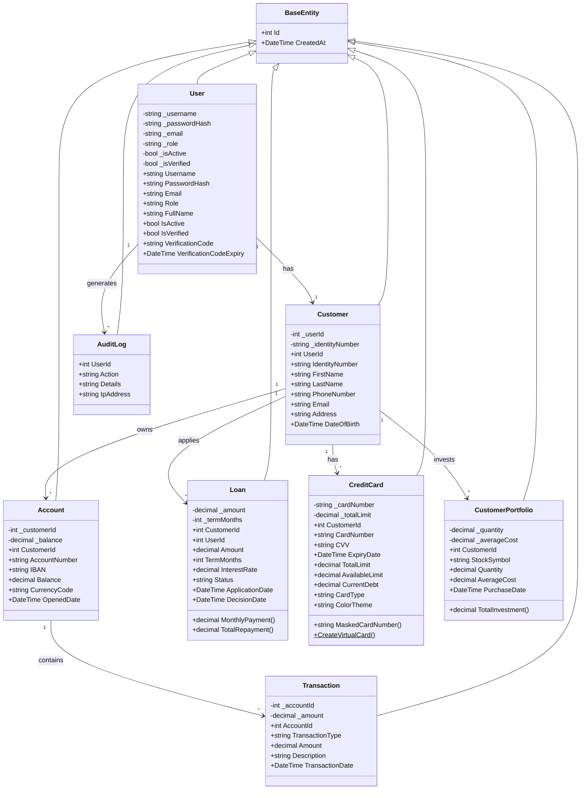
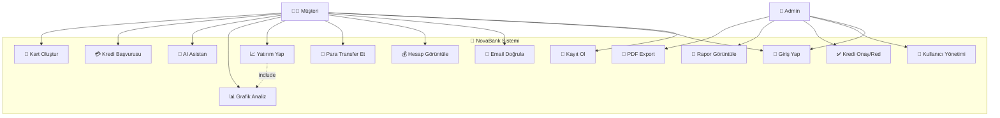
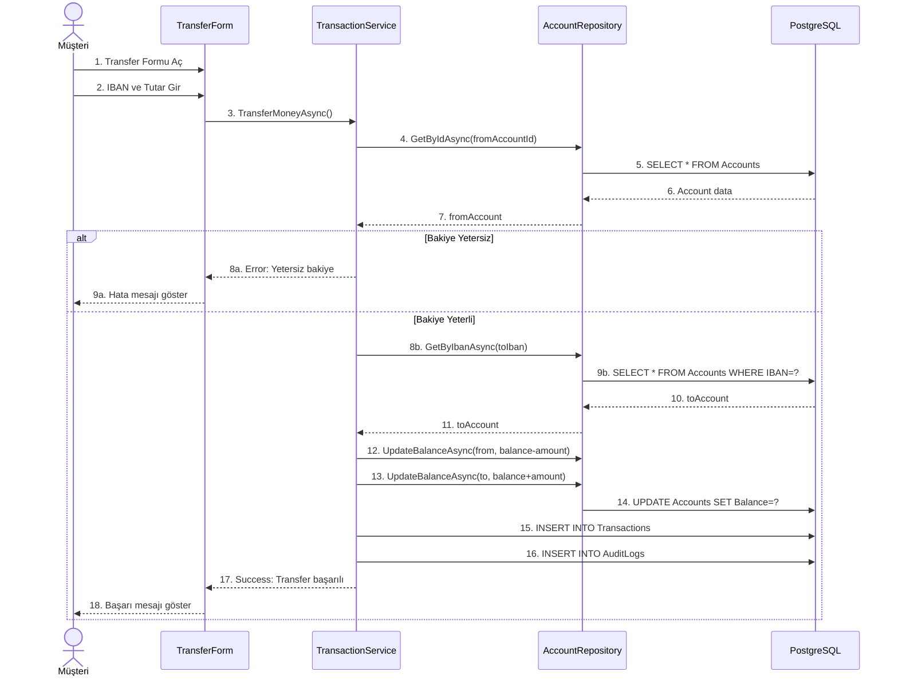
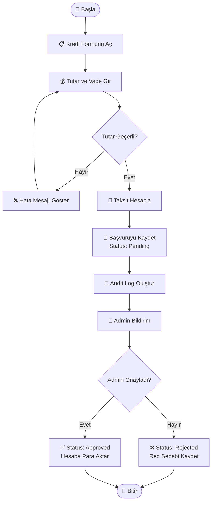
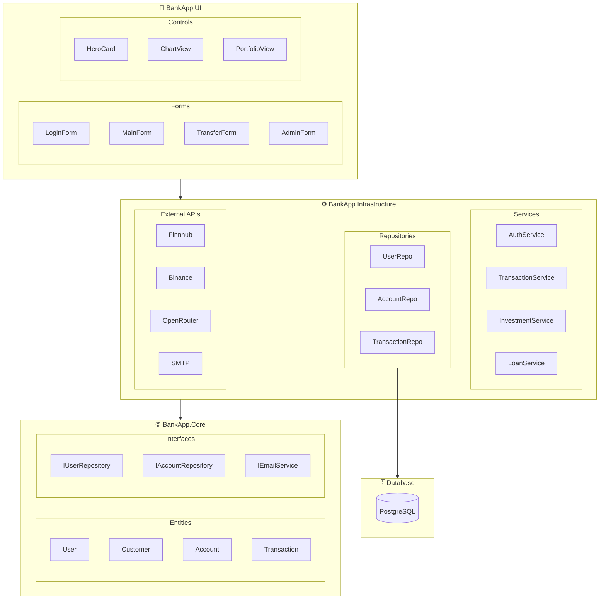
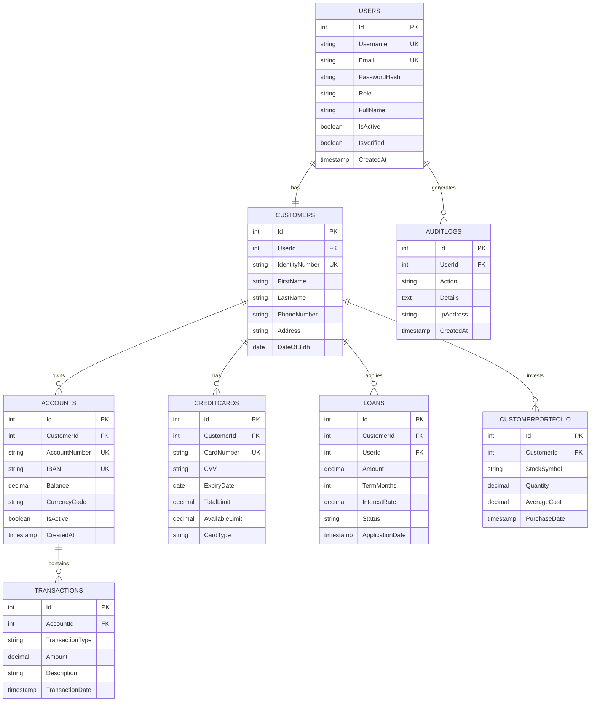
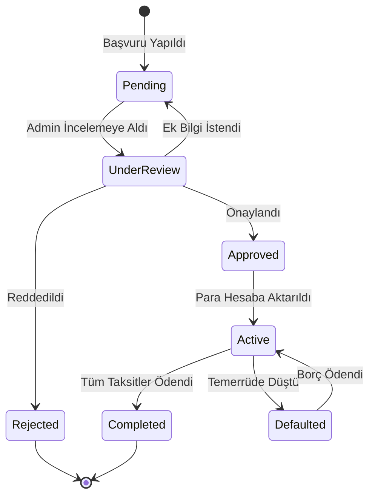
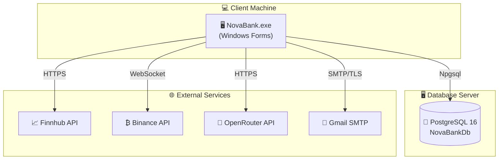

# 📊 NovaBank UML Diyagramları
## Mermaid Formatında Görsel Diyagramlar

Bu dosya, projenin UML diyagramlarını Mermaid formatında içerir. 
Mermaid Live Editor'da görüntüleyebilirsiniz: https://mermaid.live

---

## 1. Sınıf Diyagramı (Class Diagram)

---

## 2. Use Case Diyagramı

---

## 3. Sequence Diyagramı - Para Transferi

---

## 4. Activity Diyagramı - Kredi Başvurusu

---

## 5. Component Diyagramı

---

## 6. ER Diyagramı (Entity-Relationship)

---

## 7. State Diyagramı - Kredi Durumu

---

## 8. Deployment Diyagramı

---

## Nasıl Kullanılır?

### Mermaid Live Editor
1. https://mermaid.live adresine gidin
2. İstediğiniz diyagramın kodunu kopyalayın
3. Editöre yapıştırın
4. PNG/SVG olarak indirin

### Visual Studio Code
1. "Markdown Preview Mermaid Support" eklentisini yükleyin
2. Bu dosyayı VS Code'da açın
3. Preview'da diyagramları görün

### Word'e Ekleme
1. Mermaid Live Editor'da PNG olarak indirin
2. Word belgesine resim olarak ekleyin

---

*Bu diyagramlar NovaBank Dijital Bankacılık projesi için hazırlanmıştır.*
