# 📊 NovaBank UML Diyagramları
## Mermaid Formatında Görsel Diyagramlar

Bu dosya, projenin UML diyagramlarını Mermaid formatında içerir. 
Mermaid Live Editor'da görüntüleyebilirsiniz: https://mermaid.live

---

## 1. Sınıf Diyagramı (Class Diagram)

---

## 2. Use Case Diyagramı

```mermaid
graph TB
    subgraph NovaBank["🏦 NovaBank Sistemi"]
        UC1["👤 Kayıt Ol"]
        UC2["🔐 Giriş Yap"]
        UC3["📧 Email Doğrula"]
        UC4["💰 Hesap Görüntüle"]
        UC5["💸 Para Transfer Et"]
        UC6["📈 Yatırım Yap"]
        UC7["📊 Grafik Analiz"]
        UC8["🤖 AI Asistan"]
        UC9["💳 Kredi Başvurusu"]
        UC10["🎫 Kart Oluştur"]
        UC11["👥 Kullanıcı Yönetimi"]
        UC12["✅ Kredi Onay/Red"]
        UC13["📄 Rapor Görüntüle"]
        UC14["📑 PDF Export"]
    end
    
    Customer["👨‍💼 Müşteri"]
    Admin["🔧 Admin"]
    
    Customer --> UC1
    Customer --> UC2
    Customer --> UC3
    Customer --> UC4
    Customer --> UC5
    Customer --> UC6
    Customer --> UC7
    Customer --> UC8
    Customer --> UC9
    Customer --> UC10
    
    Admin --> UC2
    Admin --> UC11
    Admin --> UC12
    Admin --> UC13
    Admin --> UC14
    
    UC6 -.->|include| UC7
```

---

## 3. Sequence Diyagramı - Para Transferi

```mermaid
sequenceDiagram
    actor Müşteri
    participant TF as TransferForm
    participant TS as TransactionService
    participant AR as AccountRepository
    participant DB as PostgreSQL
    
    Müşteri->>TF: 1. Transfer Formu Aç
    Müşteri->>TF: 2. IBAN ve Tutar Gir
    TF->>TS: 3. TransferMoneyAsync()
    TS->>AR: 4. GetByIdAsync(fromAccountId)
    AR->>DB: 5. SELECT * FROM Accounts
    DB-->>AR: 6. Account data
    AR-->>TS: 7. fromAccount
    
    alt Bakiye Yetersiz
        TS-->>TF: 8a. Error: Yetersiz bakiye
        TF-->>Müşteri: 9a. Hata mesajı göster
    else Bakiye Yeterli
        TS->>AR: 8b. GetByIbanAsync(toIban)
        AR->>DB: 9b. SELECT * FROM Accounts WHERE IBAN=?
        DB-->>AR: 10. toAccount
        AR-->>TS: 11. toAccount
        TS->>AR: 12. UpdateBalanceAsync(from, balance-amount)
        TS->>AR: 13. UpdateBalanceAsync(to, balance+amount)
        AR->>DB: 14. UPDATE Accounts SET Balance=?
        TS->>DB: 15. INSERT INTO Transactions
        TS->>DB: 16. INSERT INTO AuditLogs
        TS-->>TF: 17. Success: Transfer başarılı
        TF-->>Müşteri: 18. Başarı mesajı göster
    end
```

---

## 4. Activity Diyagramı - Kredi Başvurusu

```mermaid
flowchart TD
    A([🚀 Başla]) --> B[📋 Kredi Formunu Aç]
    B --> C[💰 Tutar ve Vade Gir]
    C --> D{Tutar Geçerli?}
    D -->|Hayır| E[❌ Hata Mesajı Göster]
    E --> C
    D -->|Evet| F[🧮 Taksit Hesapla]
    F --> G[💾 Başvuruyu Kaydet<br/>Status: Pending]
    G --> H[📝 Audit Log Oluştur]
    H --> I[📨 Admin Bildirim]
    I --> J{Admin Onayladı?}
    J -->|Hayır| K[❌ Status: Rejected<br/>Red Sebebi Kaydet]
    J -->|Evet| L[✅ Status: Approved<br/>Hesaba Para Aktar]
    K --> M([🏁 Bitir])
    L --> M
```

---

## 5. Component Diyagramı

---

## 6. ER Diyagramı (Entity-Relationship)

---

## 7. State Diyagramı - Kredi Durumu

```mermaid
stateDiagram-v2
    [*] --> Pending: Başvuru Yapıldı
    Pending --> UnderReview: Admin İncelemeye Aldı
    UnderReview --> Approved: Onaylandı
    UnderReview --> Rejected: Reddedildi
    UnderReview --> Pending: Ek Bilgi İstendi
    Approved --> Active: Para Hesaba Aktarıldı
    Active --> Completed: Tüm Taksitler Ödendi
    Active --> Defaulted: Temerrüde Düştü
    Rejected --> [*]
    Completed --> [*]
    Defaulted --> Active: Borç Ödendi
```

---

## 8. Deployment Diyagramı

```mermaid
graph TB
    subgraph Client["💻 Client Machine"]
        WinForms["🖥️ NovaBank.exe<br/>(Windows Forms)"]
    end
    
    subgraph Server["🖥️ Database Server"]
        PG[(🐘 PostgreSQL 16<br/>NovaBankDb)]
    end
    
    subgraph External["🌐 External Services"]
        Finnhub["📈 Finnhub API"]
        Binance["₿ Binance API"]
        OpenRouter["🤖 OpenRouter API"]
        Gmail["📧 Gmail SMTP"]
    end
    
    WinForms -->|Npgsql| PG
    WinForms -->|HTTPS| Finnhub
    WinForms -->|WebSocket| Binance
    WinForms -->|HTTPS| OpenRouter
    WinForms -->|SMTP/TLS| Gmail
```

---

## Nasıl Kullanılır?

### Mermaid Live Editor
1. https://mermaid.live adresine gidin
2. İstediğiniz diyagramın kodunu kopyalayın
3. Editöre yapıştırın
4. PNG/SVG olarak indirin

### Visual Studio Code
1. "Markdown Preview Mermaid Support" eklentisini yükleyin
2. Bu dosyayı VS Code'da açın
3. Preview'da diyagramları görün

### Word'e Ekleme
1. Mermaid Live Editor'da PNG olarak indirin
2. Word belgesine resim olarak ekleyin

---

*Bu diyagramlar NovaBank Dijital Bankacılık projesi için hazırlanmıştır.*
